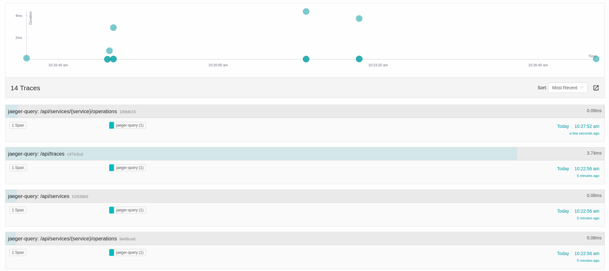
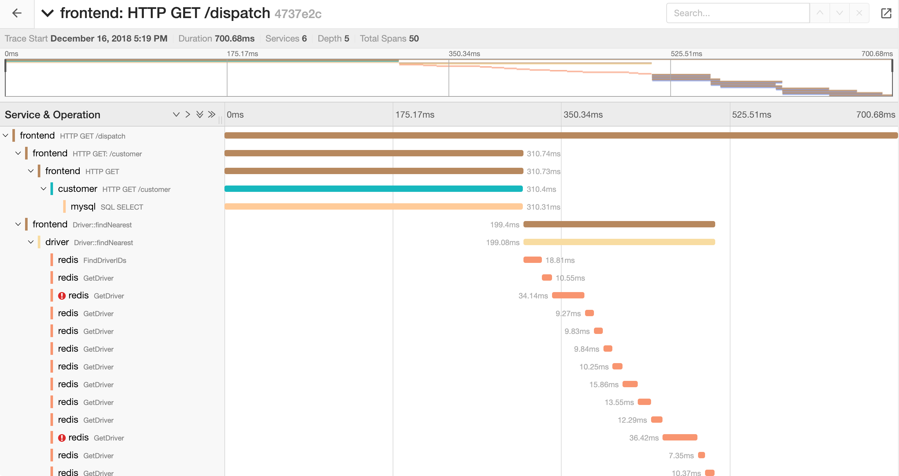
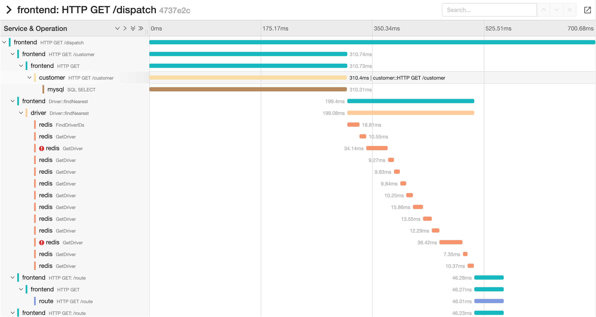
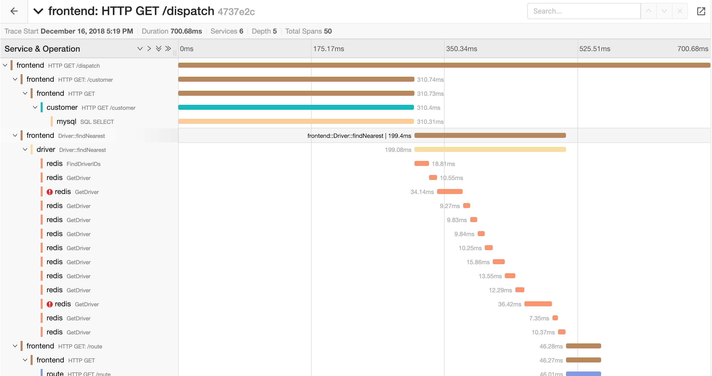
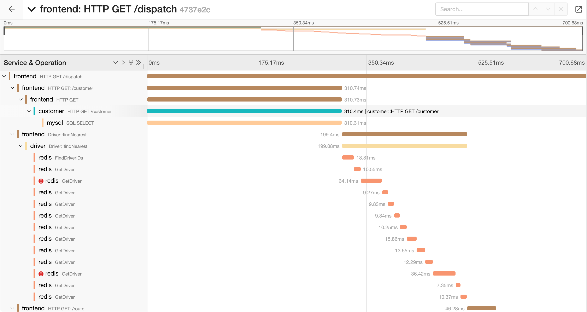
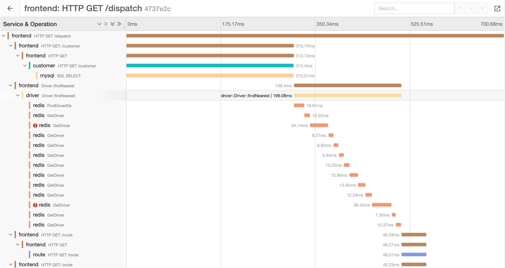

# 前端/ui

## 配置

可以配置UI的几个方面:

* 依赖项部分可以启用/配置
* 可以启用/配置Google Analytics\(分析\)跟踪
* 可以将其他菜单选项添加到全局导航

可以通过JSON配置文件配置这些选项。然后,在启动查询服务时,必须将查询服务的`--query.ui-config`命令行参数设置为JSON文件的路径。

配置文件示例:

```text
{
  "dependencies": {
    "dagMaxNumServices": 200,
    "menuEnabled": true
  },
  "archiveEnabled": true,
  "tracking": {
    "gaID": "UA-000000-2",
    "trackErrors": true
  },
  "menu":[
    {
      "label": "About Jaeger",
      "items":[
        {
          "label": "GitHub",
          "url": "https://github.com/jaegertracing/jaeger"
        },
        {
          "label": "Docs",
          "url": "http://jaeger.readthedocs.io/en/latest/"
        }
      ]
    }
  ],
  "linkPatterns":[{
    "type": "process",
    "key": "jaeger.version",
    "url": "https://github.com/jaegertracing/jaeger-client-java/releases/tag/#{jaeger.version}",
    "text": "Information about Jaeger release #{jaeger.version}"
  }]
}
```

### 依赖关系

`dependencies.dagMaxNumServices`定义了禁用DAG依赖视图之前允许的最大服务数量。默认值:200。

`dependencies.menuEnabled`启用\(`true`\)或禁用\(`false`\)依赖项菜单按钮。默认值:" true"。

### 归档支持

`archiveEnabled`启用\(`true`\)或禁用\(`false`\)归档跟踪按钮。 默认值:`false`。它需要在Query Service中配置归档存储。只能通过ID直接访问已归档的跟踪,而无法搜索。

### Google Analytics\(分析\)跟踪

`tracking.gaID`定义Google Analytics\(分析\)跟踪ID。这是Google Analytics\(分析\)跟踪所必需的, 并将其设置为非`null`值可启用Google Analytics\(分析\)跟踪。默认值:`null`。

`tracking.trackErrors`通过Google Analytics\(分析\)启用\(`true`\)或禁用\(`false`\)错误跟踪。 如果提供了有效的Google Analytics\(分析\)ID,则只能跟踪错误。 有关通过Google Analytics\(分析\)进行错误跟踪的其他详细信息, 请参阅UI repo中的[tracking README](https://github.com/jaegertracing/jaeger-ui/blob/c622330546afc1be59a42f874bcc1c2fadf7e69a/src/utils/tracking/README.md)。默认值:" true"。

### 自定义菜单项

`菜单`允许将其他链接添加到全局导航。附加链接右对齐。

在上面的示例JSON配置中,配置的菜单将带有一个标签为"关于Jaeger"的下拉菜单, 其中包含"GitHub"和"Docs"的子选项。右上方菜单中链接的格式如下:

```javascript
{
  "label":"此处有一些文字",
  "url":"https://example.com"
}
```

链接可以直接是"菜单"数组的成员,也可以组合成一个下拉菜单选项。一组链接的格式为:

```javascript
{
  "label": "Dropdown button",
  "items":[]
}
```

`items`数组应包含一个或多个链接配置。

### 链接模式

`linkPatterns`节点可用于从Jaeger UI中显示的字段创建链接。

| Field | Description |
| :--- | :--- |
| type | The metadata section in which your link will be added: process, tags, logs |
| key | The name of tag/process/log attribute which value will be displayed as a link |
| url | The URL where the link should point to, it can be an external site or relative path in Jaeger UI |
| text | The text displayed in the tooltip for the link |

可以将`url`和`text`都定义为模板\(即,使用`##field-name}`\),Jaeger UI将根据模板/日志数据动态替换值。

## 嵌入式模式

从1.9版开始,Jaeger UI提供了一种"嵌入式"布局模式, 旨在支持将Jaeger UI集成到其他应用程序中。当前\(从v0开始\), 采用的方法是从页面中删除各种UI元素,以使UI更适合于空间受限的布局。

嵌入式模式是通过URL查询参数引入和配置的。

要进入嵌入式模式,必须将`uiEmbed = v0`查询参数和值添加到URL。 例如,以下URL将以嵌入式模式显示ID为`abc123`的跟踪:

```text
http://localhost:16686/trace/abc123?uiEmbed=v0
```

需要`uiEmbed=v0`。

此外,支持的每个页面都有一个 按钮,该按钮将在新标签页中打开非嵌入式页面。

以下页面支持嵌入式模式:

* 搜索页面
* 跟踪页面

### 搜索页面

要将Search Trace Page集成到我们的应用程序中,我们必须向Jaeger UI指示我们要使用带有`uiEmbed = v0`的嵌入模式。

例如:

```text
http://localhost:16686/search?
    service=my-service&
    start=1543917759557000&
    end=1543921359557000&
    limit=20&
    lookback=1h&
    maxDuration&
    minDuration&
    uiEmbed=v0
```



#### 配置选项

以下查询参数可用于配置搜索页面的布局:

* `uiSearchHideGraph = 1`-禁用在搜索结果上方显示散点图

```text
http://localhost:16686/search?
    service=my-service&
    start=1543917759557000&
    end=1543921359557000&
    limit=20&
    lookback=1h&
    maxDuration&
    minDuration&
    uiEmbed=v0&
    uiSearchHideGraph=1
```


### 跟踪页面

要将Trace Page集成到我们的应用程序中,我们必须向Jaeger UI指示我们要使用带有`uiEmbed = v0`的嵌入模式。

例如:

```bash
http://localhost:16686/trace/{trace-id}?uiEmbed=v0
```


如果我们已经从搜索跟踪页面导航到该视图,我们将有一个按钮可以返回到结果页面。



#### 配置选项

以下查询参数可用于配置跟踪页面的布局:

* `uiTimelineCollapseTitle = 1`使跟踪头开始折叠,从而隐藏摘要和小地图。

```text
http://localhost:16686/trace/{trace-id}?
    uiEmbed=v0&
    uiTimelineCollapseTitle=1
```



\*`uiTimelineHideMinimap = 1`会完全删除小地图,而不管跟踪头是否扩展。

```text
http://localhost:16686/trace/{trace-id}?
    uiEmbed=v0&
    uiTimelineHideMinimap=1
```



\*`uiTimelineHideSummary = 1`-完全删除跟踪摘要信息\(服务数量等\),而不管跟踪头是否扩展。

```text
http://localhost:16686/trace/{trace-id}?
    uiEmbed=v0&
    uiTimelineHideSummary=1
```



我们还可以结合以下选项:

```text
http://localhost:16686/trace/{trace-id}?
    uiEmbed=v0&
    uiTimelineHideMinimap=1&
    uiTimelineHideSummary=1
```



