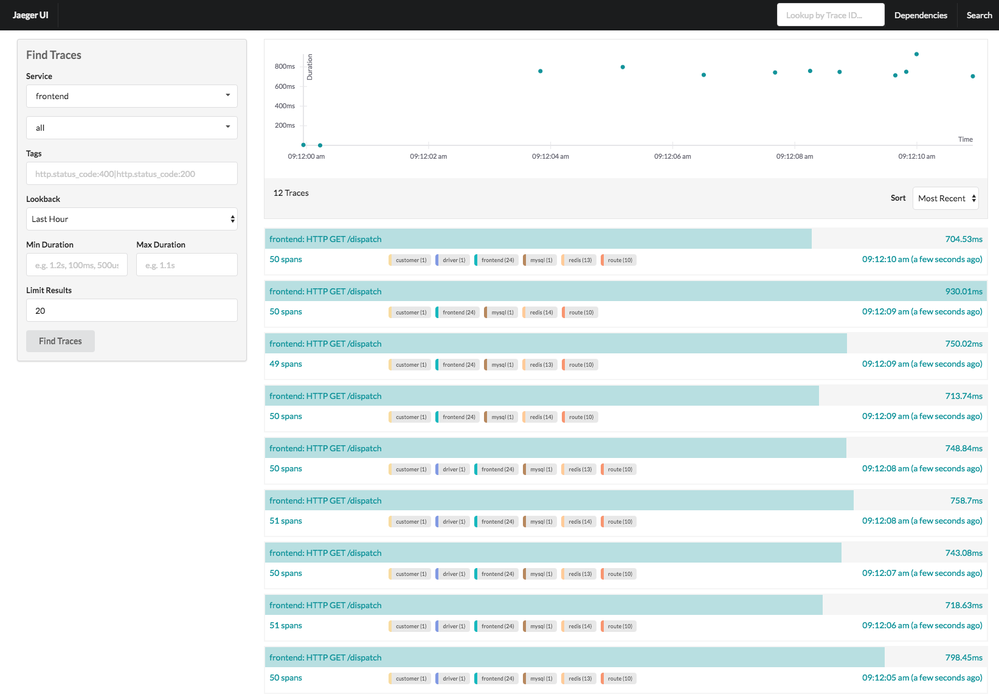
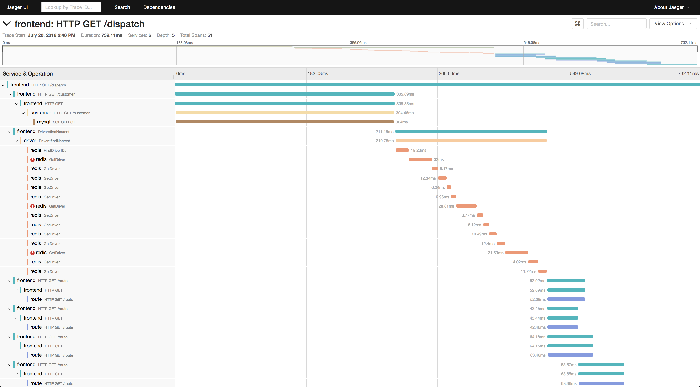

# 介绍

## 介绍

欢迎使用Jaeger文档门户网站,接下来,您将找到面向初学者和经验丰富的Jaeger用户的信息

如果您找不到您想要的东西,或者这里没有解决问题,我们很乐意在[Gitter chat](https://gitter.im/jaegertracing/Lobby)上与您联系, 我们的[邮件列表](https://groups.google.com/forum/#!forum/jaeger-tracing)或 [Github](https://github.com/jaegertracing/jaeger/issues)。

### 关于

Jaeger受[Dapper](https://research.google.com/pubs/pub36356.html)和[OpenZipkin](http://zipkin.io)的启发, 是由[Uber Technologies](http://uber.github.io/)作为开源发布的分布式跟踪系统。 它用于监视和诊断基于微服务的分布式系统,包括:

* 分布式上下文传播
* 分布式交易监控
* 根本原因分析
* 服务依赖性分析
* 性能/延迟优化

Uber发表了一篇博客文章,[Uber不断发展的分布式追踪](https://eng.uber.com/distributed-tracing/), 其中解释了Jaeger在架构选择方面的历史和原因. Jaeger的创建者[Yuri Shkuro](https://shkuro.com)也出版了一本书 [Mastering Distributed Tracing](https://shkuro.com/books/2019-mastering-distributed-tracing/), 其中涵盖了深入了解Jaeger的设计和操作的各个方面,以及一般的分布式跟踪。

### 特性

\*[OpenTracing](http://opentracing.io/)兼容的数据模型和依赖库

* 在[Go](https://github.com/jaegertracing/jaeger-client-go),

  [Java](https://github.com/jaegertracing/jaeger-client-java),

  [Node](https://github.com/jaegertracing/jaeger-client-node),

  [Python](https://github.com/jaegertracing/jaeger-client-python)和[C ++](https://github.com/jaegertracing/cpp-client)

  * 对每个服务/端点概率使用一致的前期采样
  * 多个存储后端:Cassandra,Elasticsearch,内存。
  * 自适应采样\(即将推出\)
  * 收集后数据处理管道\(即将推出\)

有关更多详细信息,请参见[功能](features.md)页面。

### 技术规范

* Go中实现的后端组件
* React/Javascript用户界面
* 支持的存储后端:

  \*[Cassandra 3.4 +](../deployment/#cassandra)

  \*[Elasticsearch 5.x,6.x,7.x](../deployment/#elasticsearch)

  \*[Kafka](../deployment/#kafka)

  * 内存存储

### 快速开始

请参阅[在一个映像中全部运行docker](https://github.com/du2016/jaeger-doc-zh/tree/2888ea563a0fd2ef7bf79c0d807f3ecd4d1ee924/getting-started/README.md#all-in-one)。

### 屏幕截图

#### 跟踪视图

#### 跟踪详细信息视图

## 相关链接

* [Uber Engineering不断发展的分布式跟踪](https://eng.uber.com/distributed-tracing/)
* [掌握分布式跟踪](https://shkuro.com/books/2019-mastering-distributed-tracing/)
* [使用OpenTracing在Go中跟踪HTTP请求延迟](https://medium.com/opentracing/tracing-http-request-latency-in-go-with-opentracing-7cc1282a100a)
* [使用Jaeger和Prometheus在Kubernetes上进行分布式跟踪](https://blog.openshift.com/openshift-commons-briefing-82-distributed-tracing-with-jaeger-prometheus-on-kubernetes/)
* [将Jaeger与Istio一起使用](https://istio.io/docs/tasks/telemetry/distributed-tracing.html)
* [将Jaeger与Envoy一起使用](https://www.envoyproxy.io/docs/envoy/latest/start/sandboxes/jaeger_tracing.html)

